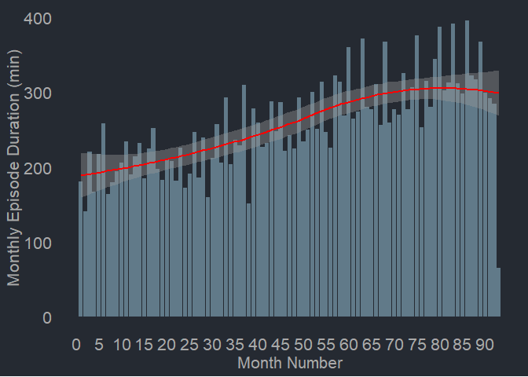
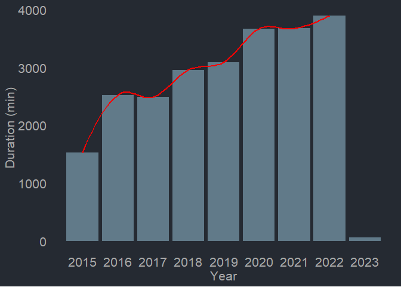
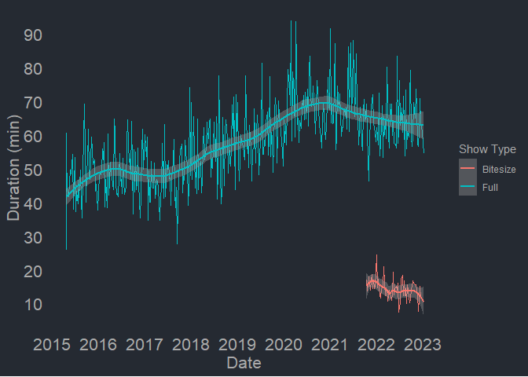
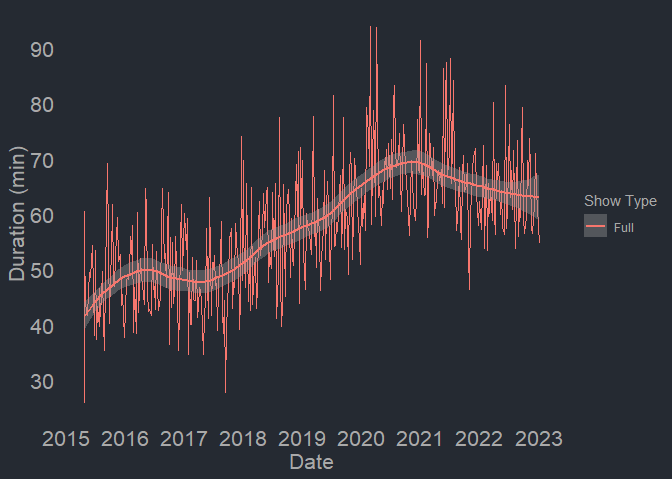
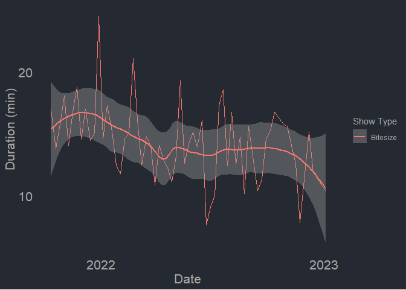
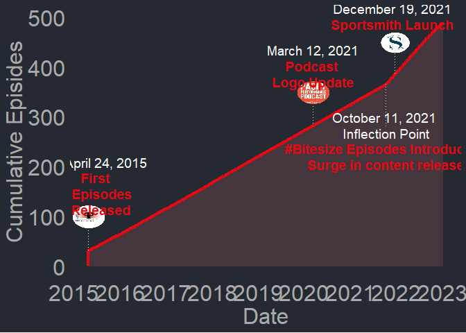

# {paceypodcastR}

Package for Scraping, Analyzing and Visualizing Pacey Performance
Podcast Data


<!-- badges: start -->

[](https://www.tidyverse.org/lifecycle/#experimental)

<!-- badges: end -->

**{paceypodcastR}** is a package developed to easily gather and explore
data from the [Pacey Performance Podcast host
site](https://paceyperformancepodcast.podbean.com/). This package was
built as a tutorial on how to build packages in R for the Sportsmith R
Course. It features functions for scraping all Pacey Performance Podcast
episodes, text mining analysis, provides several vizualizations, and
produces a shiny app.

## Installation

You can install the development version of paceypodcastR from
[GitHub](https://github.com/) with:

``` r
# install.packages("devtools")
devtools::install_github("rmcurtis43/paceypodcastR")
```

## Examples

``` r
library(paceypodcastR)
## basic example code
```

# Gather all Pacey Performance Podcast data using:

``` r
head(podcast_data())
```

    ## # A tibble: 6 x 12
    ##   title     date       descr~1 durat~2 url   guest descr~3 show_~4 show_~5  year
    ##   <chr>     <date>     <chr>     <dbl> <chr> <chr> <chr>     <int> <chr>   <dbl>
    ## 1 "Pacey P~ 2015-04-24 "The f~    25.8 http~ Ben ~ "The f~       1 Full     2015
    ## 2 "Pacey P~ 2015-04-24 "In th~    31.1 http~ Keir~ "In th~       2 Full     2015
    ## 3 "Pacey P~ 2015-04-24 "This ~    36.4 http~ Mike~ "This ~       3 Full     2015
    ## 4 "Pacey P~ 2015-04-24 "This ~    41.9 http~ Andy~ "This ~       4 Full     2015
    ## 5 " Pacey ~ 2015-04-24 "The f~    33.2 http~ Dan ~ "The f~       5 Full     2015
    ## 6 "Pacey P~ 2015-04-24 "After~    38.7 http~ Mlad~ "After~       6 Full     2015
    ## # ... with 2 more variables: week <dbl>, weekday <chr>, and abbreviated
    ## #   variable names 1: description, 2: duration, 3: description_clean,
    ## #   4: show_num, 5: show_type

# Explore Monthly or Yearly Trends in Episode Duration:

``` r
duration_month_chart()
```

<!-- -->

``` r
duration_year_chart()
```

<!-- -->

# Visualize Show Type Trends Together or in Isolation

``` r
duration_show_type_chart()
```

<!-- -->

``` r
duration_show_type_chart(episode_type = "Full")
```

<!-- -->

``` r
duration_show_type_chart(episode_type = "Bitesize")
```

<!-- -->

# Display a Show Timeline

``` r
timeline_chart()
```

<!-- -->

# paceypodcastR Shiny App

------------------------------------------------------------------------

<video auto-play="true" loop="loop" width="1000" height="800" controls>
<source src="inst/videos/paceypodcastR_app.mp4" type="video/mp4">
</video>
